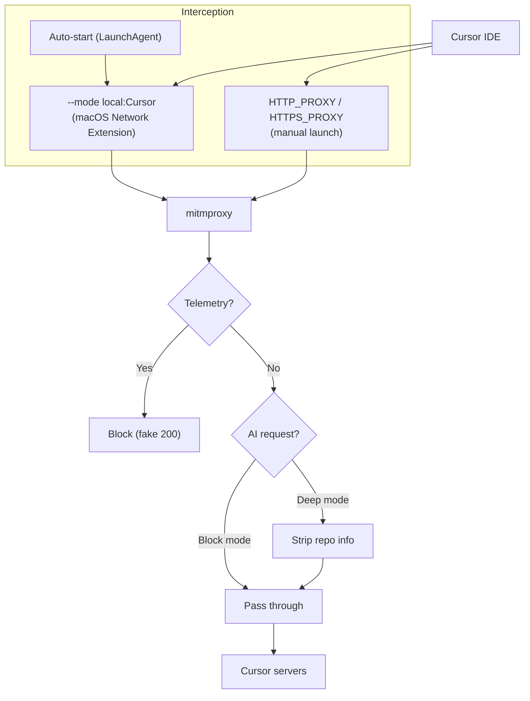

# Cursor Telemetry Blocker

Block Cursor IDE telemetry while keeping AI features fully functional.

```bash
curl -fsSL https://raw.githubusercontent.com/taberoajorge/cursor-telemetry-blocker/main/install.sh | bash
```

## What it does

Cursor IDE sends telemetry data including metrics, analytics, repository names, commit info, and workspace paths to various endpoints. This tool intercepts that traffic through a local mitmproxy and blocks or sanitizes it before it leaves your machine.

**AI features keep working.** Only telemetry, analytics, and tracking requests are blocked.

## Table of Contents

- [Quick Start](#quick-start)
- [Dashboard](#dashboard)
- [Auto-Start](#auto-start)
- [Modes](#modes)
- [What Gets Blocked](#what-gets-blocked)
- [How It Works](#how-it-works)
- [Configuration](#configuration)
- [Project Structure](#project-structure)
- [Contributing](#contributing)
- [License](#license)

## Quick Start

### One-liner install

```bash
curl -fsSL https://raw.githubusercontent.com/taberoajorge/cursor-telemetry-blocker/main/install.sh | bash
```

### Manual install

```bash
git clone https://github.com/taberoajorge/cursor-telemetry-blocker.git
cd cursor-telemetry-blocker
make install
make ca-cert    # install mitmproxy CA certificate (first time only)
make run        # start in block mode
```

### Homebrew

```bash
brew tap taberoajorge/cursor-telemetry-blocker
brew install cursor-telemetry-blocker
cursor-private
```

## Dashboard

Interactive terminal UI showing real-time proxy activity with live counters, categorized tabs, and keyboard shortcuts.

```bash
make dashboard
```

```
+-----------------------------------------------+
|  Cursor Telemetry Blocker    LIVE  00:14:32    |
+-----------------------------------------------+
|  Blocked 847   Passed 312   Stripped 45        |
+-----------------------------------------------+
| [All] [Blocked] [Passed] [Stripped]            |
|-----------------------------------------------|
| 14:32:01  BLOCKED   metrics.cursor.sh/v1/t... |
| 14:32:01  PASSED    api2.cursor.sh/ChatSer... |
| 14:32:02  STRIPPED  api2.cursor.sh/AiServi... |
+-----------------------------------------------+
| q Quit  p Pause  c Clear  t Theme             |
+-----------------------------------------------+
```

Keyboard shortcuts:

| Key | Action |
|-----|--------|
| `q` | Quit |
| `p` | Pause/resume event stream |
| `c` | Clear current log view |
| `t` | Toggle dark/light theme |
| `1` `2` `3` `4` | Jump to All/Blocked/Passed/Stripped tab |
| `Tab` | Cycle through tabs |

Run the dashboard alongside the proxy (in a separate terminal), or launch both together:

```bash
DASHBOARD=1 make run
```

## Auto-Start

On macOS, the telemetry blocker can run as a background service that starts automatically on login. Just open Cursor normally and traffic is intercepted transparently.

```bash
make service-install       # install and start the service
make service-status        # check if it's running
make service-uninstall     # remove the service
```

The installer wizard (`install.sh`) includes this as an interactive step.

**Transparent mode** (recommended): If mitmproxy is installed via Homebrew (`brew install mitmproxy`), the service uses `--mode local:Cursor` which intercepts Cursor traffic at the OS level via macOS Network Extension. No proxy env vars or special launch needed.

**Fallback mode**: Without Homebrew mitmproxy, the service runs as an explicit proxy on port 18080. You still need to launch Cursor with proxy env vars or set `"http.proxy"` in Cursor settings.

## Modes

| Mode | Command | Description |
|------|---------|-------------|
| **block** | `make run` | Block telemetry domains and gRPC paths. AI requests pass through unchanged. |
| **deep** | `make run-deep` | Same as block, plus strip repository names, workspace paths, and remote URLs from AI gRPC payloads. |
| **observe** | `make observe` | Log all traffic to `cursor_traffic.log` without blocking anything. Useful for discovering new endpoints. |

## What Gets Blocked

### Domains

| Domain | Purpose |
|--------|---------|
| `metrics.cursor.sh` | Cursor metrics collection |
| `mobile.events.data.microsoft.com` | Microsoft telemetry |
| `default.exp-tas.com` | Statsig experiment/feature flags |
| `cursor-user-debugging-data.s3.us-east-1.amazonaws.com` | Debug data uploads |
| `repo42.cursor.sh` | Codebase indexing uploads |
| `api.turbopuffer.com` | Third-party embedding storage |
| `statsig.cursor.sh` | Statsig analytics |
| `*.ingest.sentry.io` | Sentry error reporting |

### gRPC Paths

| Path | Purpose |
|------|---------|
| `ClientLoggerService` | Client logging |
| `AnalyticsService/Batch` | Analytics batch |
| `AnalyticsService/Track` | Event tracking |
| `AiService/ReportCommitAiAnalytics` | Commit analytics |
| `AiService/ReportUsageEvent` | Usage events |
| `AiService/UpdateVscodeProfile` | Profile updates |
| `IndexerService` | Codebase indexing |
| `RepositoryService` | Repository tracking |
| `DashboardService` | Dashboard analytics |

### Deep Mode: Stripped from AI Requests

In deep mode, the following fields are redacted from gRPC protobuf payloads before they reach Cursor's AI servers:

- `remote_urls` (git remote URLs)
- `remote_names` (git remote names)
- `repo_name` (repository name)
- `repo_owner` (repository owner)
- `workspace_root_path` (local directory path)
- `workspace_uri` (workspace URI)
- `is_tracked` (set to false)

## How It Works



**Transparent mode** (auto-start with Homebrew mitmproxy):
1. A macOS LaunchAgent starts mitmproxy with `--mode local:Cursor` on login
2. The macOS Network Extension intercepts Cursor's traffic at the OS level
3. No proxy env vars needed. Just open Cursor normally.

**Manual mode** (explicit proxy):
1. Cursor launches with `HTTP_PROXY`/`HTTPS_PROXY` pointing to local mitmproxy on port 18080
2. mitmproxy's Python addon inspects each request

**Both modes share the same filtering pipeline:**
1. Telemetry requests get a fake 200 response (blocked)
2. AI requests pass through (optionally stripped of repo info in deep mode)
3. Auth, marketplace, and other requests pass through unchanged

## Configuration

### Default block lists

All block lists are in `config/default.toml`, organized by category:

```toml
[domains]
telemetry = ["metrics.cursor.sh", ...]
indexing = ["repo42.cursor.sh", ...]

[grpc]
analytics = ["AnalyticsService/Batch", ...]
repo_tracking = ["RepositoryService", ...]

[options]
block_sentry = true
proxy_port = 18080
```

### Hosts file blocking

For DNS-level blocking (works even without the proxy):

```bash
make hosts
```

## Project Structure

```
src/cursor_telemetry_blocker/
  config.py                Shared block lists, logger factory, classification
  events.py                Structured event emitter/reader (JSON lines)
  dashboard.py             Interactive TUI dashboard (Textual)
  dashboard.tcss           Dashboard styling
  filter.py                Block mode mitmproxy addon
  deep_filter.py           Deep mode addon (protobuf stripping)
  observer.py              Observe mode addon
  protobuf.py              Varint/gRPC frame encode/decode
scripts/
  cursor-private.sh        Main launcher (macOS + Linux)
  cursor-blocker-service.sh  LaunchAgent installer/manager
  setup-ca-cert.sh         CA certificate installer
  setup-hosts.sh           Hosts file blocker
config/
  default.toml             Default block list configuration
proto/
  aiserver_v1.proto        Cursor AI gRPC schema reference
```

## Contributing

1. Run in observe mode to discover new telemetry endpoints: `make observe`
2. Check `cursor_traffic.log` for unblocked telemetry
3. Add new domains to `BLOCKED_DOMAINS` in `src/cursor_telemetry_blocker/config.py`
4. Add new gRPC paths to `BLOCKED_GRPC_PATHS` in the same file
5. Mirror changes in `config/default.toml` and `scripts/setup-hosts.sh`
6. Test with `make run` and verify blocking in the log

## License

[MIT](LICENSE)
